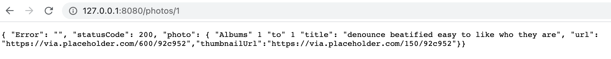

## File Overview:

- lab-08.js: A server code (with Fastify and Node.js) that fetches json photo objects from JSONPlaceholder. Also works with request parameters.
  
- package.json: Packages used in this lab.
